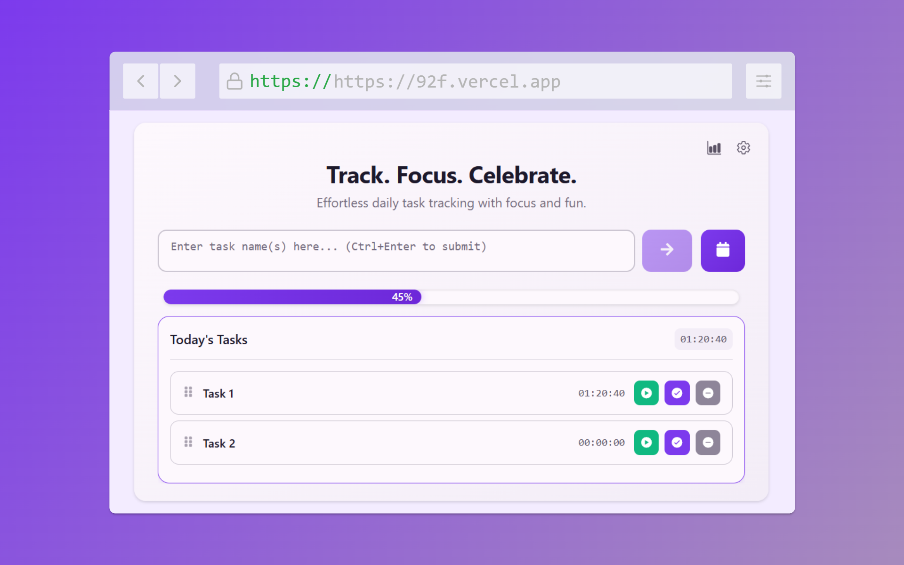

<style>
  .centered {
    text-align: center;
  }
</style>

<div class="centered">
  <h1>9-to-Fine</h1>
  <p>Welcome to <strong>9-to-Fine</strong>, where productivity meets style! This isn't just another task management app—it's your personal assistant for conquering the day with flair. Organize your tasks, track your time, and vibe to some lofi beats while you're at it. Whether you're a night owl or an early bird, 9-to-Fine has got your back.</p>
</div>




## Features

### Task Management

- Create, edit, and delete tasks effortlessly
- Organize tasks by date with a clean and intuitive interface
- Mark tasks as complete and track progress
- "Today's Tasks" section for quick access to daily priorities

### Time Tracking

- Start, pause, and stop timers for individual tasks
- Persistent time tracking across sessions
- Real-time timer display with accurate calculations
- Total time spent on tasks automatically updated

### Reports and Insights

- Generate daily, weekly, and monthly task reports
- Visualize task completion trends and time allocation

### User Experience

- Toggle lofi background music for a focused work environment
- Integrated YouTube player for seamless playback
- Switch between light and dark themes
- Persistent theme and music settings saved in localStorage

### Notifications

- Enable reminders for upcoming tasks
- Customizable notification settings

### Data Persistence

- Tasks and settings saved securely using Supabase

## Technical Stack

- **Frontend Framework**: React 19 with TypeScript
- **State Management**: React Context and custom hooks
- **Drag and Drop**: @hello-pangea/dnd
- **Icons**: react-icons
- **Backend**: Supabase for authentication and data storage
- **Build Tool**: Vite
- **Development Tools**: ESLint, TypeScript

## Project Structure

```
src/
├── components/
│   ├── DateFilter.tsx       # Filter tasks by date
│   ├── DaySection.tsx       # Day-wise task container
│   ├── LofiToggle.tsx       # Lofi mode toggle component
│   ├── NotificationToggle.tsx # Notification settings toggle
│   ├── ReportPage.tsx       # Task reports and insights
│   ├── SettingsModal.tsx    # User settings modal
│   ├── TaskInput.tsx        # New task creation form
│   ├── TaskItem.tsx         # Individual task component
│   └── ThemeToggle.tsx      # Theme toggle component
├── contexts/
│   └── AuthContext.tsx      # Authentication context
├── hooks/
│   ├── useAuthActions.ts    # Authentication-related hooks
│   ├── useCalendar.ts       # Calendar utilities
│   ├── useDocumentTitle.ts  # Dynamic document title updates
│   ├── useIncompleteDates.ts # Fetch incomplete tasks by date
│   ├── useLofi.ts           # Lofi music state management
│   ├── useNotifications.ts  # Notification management
│   ├── useSettingsModal.ts  # Settings modal state
│   ├── useTasks.ts          # Task management hooks
│   └── useTheme.ts          # Theme state management
├── types/
│   └── index.ts             # TypeScript interfaces
├── utils/
│   ├── lofiVideos.ts        # Lofi video playlist
│   ├── supabase.ts          # Supabase client setup
│   ├── taskUtils.ts         # Task-related utilities
│   ├── timeUtils.ts         # Time formatting utilities
│   └── youtubePlayer.ts     # YouTube player utilities
├── App.tsx                  # Main application component
└── App.css                  # Application styling
```

## Task Model

```typescript
interface Task {
  id: number; // Unique identifier
  user_id: string; // User ID associated with the task
  name: string; // Task name
  total_time: number; // Total time in milliseconds
  start_time: string | null; // Timestamp when timer started
  is_running: boolean; // Current timer status
  is_completed: boolean; // Task completion status
  current_day: string; // Associated date (YYYY-MM-DD)
  postponed_to: string | null; // Postponed date (if any)
  position: number; // Position in the task list
  created_at: string; // Task creation timestamp
  updated_at: string; // Task last updated timestamp
}
```

## Development

### Prerequisites

- Node.js (Latest LTS version recommended)
- npm or yarn

### Setup

1. Clone the repository
2. Install dependencies:
   ```bash
   npm install
   ```
3. Start development server:
   ```bash
   npm run dev
   ```

### Available Scripts

- `npm run dev`: Start development server
- `npm run build`: Build for production
- `npm run lint`: Run ESLint
- `npm run preview`: Preview production build

## Contributing

1. Fork the repository
2. Create your feature branch (`git checkout -b feature/AmazingFeature`)
3. Commit your changes (`git commit -m 'Add some AmazingFeature'`)
4. Push to the branch (`git push origin feature/AmazingFeature`)
5. Open a Pull Request

## License

This project is licensed under the MIT License.
